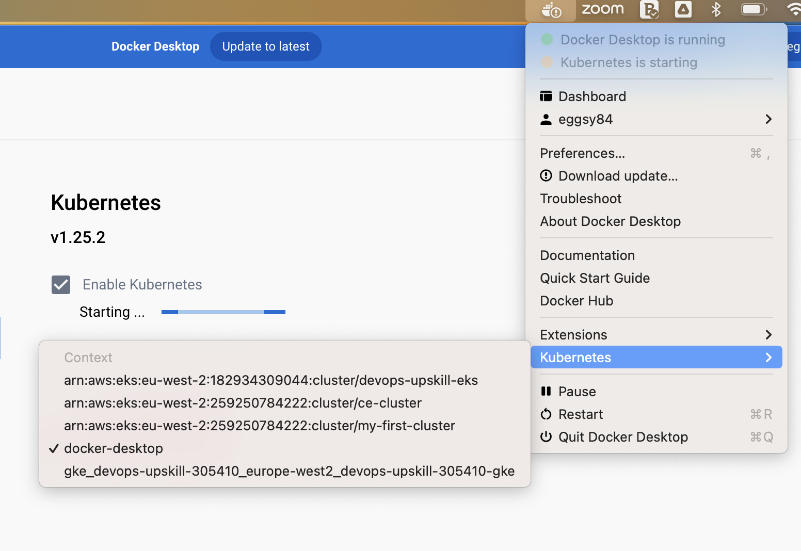

# ArgoCD

## Introduction

It's time to go all GitOps and utilise [ArgoCD](https://argo-cd.readthedocs.io/en/stable/) to implement a GitOps workflow.

In this exercise you will deploy ArgoCD to your Kubernetes cluster so you'll have ArgoCD running in your cluster.

Once deployed you will configure ArgoCD to monitor a repository (this one) and decide whether to make changes to your cluster.

## Instructions

### Starting kubernetes

You'll use local kubernetes for this one.

Start up your local version of kubernetes and make sure you can connect to it using `kubectl`

You can test your `kubectl` connection but trying `kubectl get nodes`

**💡 HINT:** If you have recently used kubectl to connect to another Kubernetes cluster, you can switch the context back to **docker-desktop** by clicking the Docker Desktop icon, hovering over Kubernetes and choosing the **docker-desktop** context. Example shown in the screenshot



### Installing ArgoCD

Next you will deploy ArgoCD to your cluster.

To do this firstly create a separate [Kubernetes namespace](https://kubernetes.io/docs/concepts/overview/working-with-objects/namespaces/) for ArgoCD

```
kubectl create namespace argocd
```

Then apply the YAML files associated with Argo. The command below just applies a YAML file called [install.yaml](https://raw.githubusercontent.com/argoproj/argo-cd/stable/manifests/install.yaml) that contains all the various services, deployments for ArgoCD.

```
kubectl apply -n argocd -f https://raw.githubusercontent.com/argoproj/argo-cd/stable/manifests/install.yaml
```

You can see if your ArgoCD pods deployed by running:

```
kubectl get pods -n argocd
```

And you should see something similar to:

```
NAME                                                READY   STATUS    RESTARTS   AGE
argocd-application-controller-0                     1/1     Running   0          78s
argocd-applicationset-controller-55c8466cdf-srbt7   1/1     Running   0          78s
argocd-dex-server-6cd4c7498f-9v8z4                  1/1     Running   0          78s
argocd-notifications-controller-65cddcf9d6-kq574    1/1     Running   0          78s
argocd-redis-74d77964b-x8bh6                        1/1     Running   0          78s
argocd-repo-server-96b577c5-8b6b8                   1/1     Running   0          78s
argocd-server-7c7b5568cc-b85v8                      1/1     Running   0          78s
```

### Obtaining the ArgoCD password

To log in to the ArgoCD user interface you will need to obtain the password.

Run the following command to obtain your admin password, once **all** of your pods are ready and running:

**🗒️ NOTE:** If the password is printed with a percent (%) sign you can ignore this character. The percent just indicates the end of line

**Unix**

```
kubectl -n argocd get secret argocd-initial-admin-secret -o jsonpath="{.data.password}" | base64 -d
```

**Windows**

Windows users running Powershell will get an error when running the above command to get the ArgoCD password due to Powershell having to decode using base64 in a different way.

To get around this, Windows users will need to run this command to get the string into a variable

```
$argocdpass = kubectl -n argocd get secret argocd-initial-admin-secret -o jsonpath="{.data.password}"
```

Then just type the variable name to get the contents and add that into the command below to get your ArgoCD password:

```
[Text.Encoding]::Utf8.GetString([Convert]::FromBase64String('**paste argocd pass output in here**'))
```

Take note of this password, you will use it shortly

### Port forwarding to access ArgoCD

Now you will use Kubernetes port forwarding to access the user interface

```
kubectl port-forward svc/argocd-server -n argocd 8080:443
```

### Logging into ArgoCD

Now open up your browser and navigate to [http://localhost:8080](http://localhost:8080)

Your browser will warn you about the certificate, choose Advanced and **Proceed anyway**

You should then see the ArgoCD log in page

Enter the username **admin**

Enter the password received in the previous step and log in

### Setting up your repository

This repository is private within your GitHub account so in order for ArgoCD to be able to access it we need to configure ArgoCD with access.

To do this we will use a personal access token and configure that with ArgoCD.

Follow the video below to create your personal access token and utilise it with ArgoCD.

[Video on creating personal access token](https://cloud-engineering-learners-media.s3.eu-west-2.amazonaws.com/argocd/argo_personal_token.mp4)

More detail on this stage can also be found on the [ArgoCD private repos documentation](https://argo-cd.readthedocs.io/en/stable/user-guide/private-repositories/)

### Setting up the app

Next let's configure ArgoCD with a brand new application, in our case it will be that trusty NGiNX container.

You can see the YAML files that ArgoCD will monitor within the [nginx-argo-example](./nginx-argo-example/) directory.

Follow the video below to setup your application

[Video on setting up ArgoCD app](https://cloud-engineering-learners-media.s3.eu-west-2.amazonaws.com/argocd/argocd_app_setup.mp4)

### Validating the app is running

If you get nice green ticks of the container running, try `kubectl get pods` locally to see the NGiNX container running

### Making a change

Let's now go all GitOps and make a change via Git that Argo will observe and synchronise across your cluster.

In this video, we'll show an example of how to make a change in git and how that is reflected in ArgoCD.

[Video on seeing change reflected in ArgoCD](https://cloud-engineering-learners-media.s3.eu-west-2.amazonaws.com/argocd/argocd_state_sync.mp4)

## Extension exercise

### Your own image and rolling out a change

You'll see there is a folder called **my-app** and the YAML files in there are empty.

Try populating those files in order to deploy one of your own containers, such as the Java Spring boot app, to your cluster via ArgoCD.

To help guide you, you will need:

- Make sure you have pushed your image to your own container registry. You could do this with CircleCI if you have completed that task.

- Make sure ArgoCD port forwarding is enabled, log in to ArgoCD and set up a **New App**

- Point that project at the **my-app** directory

## Submission process

1. Fork this repository

2. Remember to commit and push regularly to your repository

3. Complete the SOLUTION.md

4. Share link to your repository as indicated

## Further reading

[ArgoCD documentation](https://argo-cd.readthedocs.io/en/stable/)
